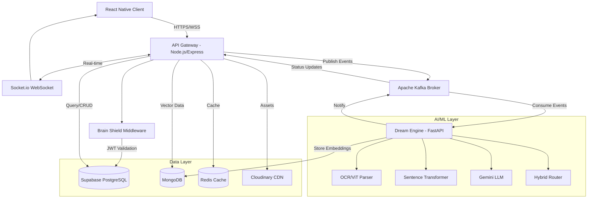
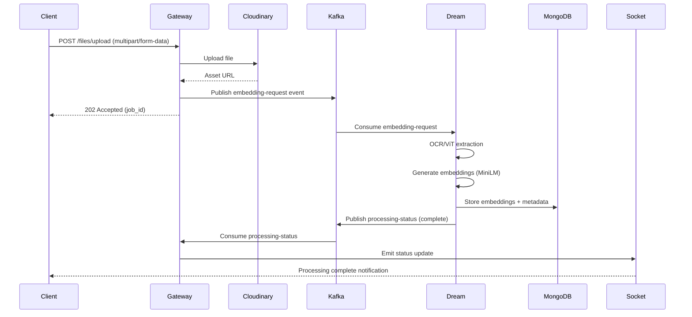
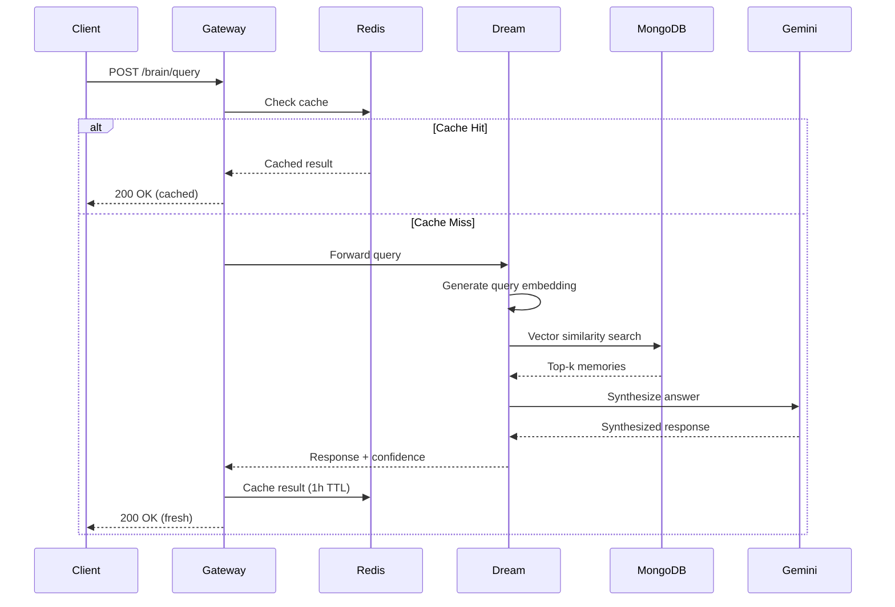

# Design Document: Brain Extension

## Overview

Brain Extension is an AI-powered Cognitive OS that emulates biological cognitive functions to help engineering students in Tier-2/Tier-3 cities in India manage and interact with their study materials. The system uses an event-driven microservices architecture with Domain-Driven Design (DDD) principles, enabling asynchronous processing of content through a "Dreaming Protocol" while providing real-time feedback to users.

### Key Design Principles

1. **Event-Driven Architecture**: Asynchronous message streaming via Apache Kafka decouples content ingestion from processing
2. **Domain-Driven Design**: Clear bounded contexts for Authentication, Cognitive Management, Content Processing, and Query Processing
3. **Zero-Trust Security**: All requests validated through Brain Shield middleware with cryptographic JWT verification
4. **Semantic Isolation**: Lobe-based vector spaces prevent cross-contamination between subjects
5. **Real-Time Feedback**: WebSocket connections provide immediate processing status updates
6. **Performance Optimization**: Multi-layer caching strategy with Redis for sub-100ms response times

### System Context

The Brain Extension system consists of three primary components:
- **React Native Mobile Client**: User-facing mobile application with 60fps animations
- **API Gateway (Node.js)**: Primary backend handling HTTP/WebSocket requests and orchestration
- **Dream Engine (Python FastAPI)**: AI/ML worker service for content processing and synthesis

## Architecture

### High-Level Architecture Diagram



### Component Responsibilities

#### React Native Client
- **Responsibilities**: User interface, state management (Redux), real-time updates, graph visualization
- **Technologies**: React Native, React Native Reanimated, React Native Graphs, Socket.io-client
- **Communication**: HTTPS REST API, WebSocket for real-time updates

#### API Gateway (Node.js)
- **Responsibilities**: Request routing, authentication, WebSocket management, Kafka event publishing, response caching
- **Technologies**: Node.js, Express, Socket.io, Multer, Kafka client
- **Ports**: 3000 (HTTP), 3001 (WebSocket)

#### Brain Shield Middleware
- **Responsibilities**: JWT validation, Zero-Trust security enforcement, request authorization
- **Technologies**: Supabase Auth SDK, cryptographic validation
- **Pattern**: Middleware chain executed before all protected routes

#### Dream Engine (Python FastAPI)
- **Responsibilities**: Content parsing (OCR/ViT), vector embedding generation, semantic search, LLM synthesis, translation
- **Technologies**: FastAPI, PyTorch, Sentence Transformers, Hugging Face, LangChain, Scikit-learn
- **Ports**: 8000 (HTTP API)

#### Apache Kafka
- **Responsibilities**: Asynchronous event streaming, reliable message delivery, worker coordination
- **Topics**: `embedding-requests`, `translation-requests`, `processing-status`, `graph-updates`

### Data Flow Diagrams

#### Content Ingestion Flow (Dreaming Protocol)



#### Query Processing Flow



## Components and Interfaces

### Bounded Contexts

#### Authentication Context
- **Entities**: User, Session, JWT Token
- **Services**: AuthService, TokenValidator
- **Repositories**: UserRepository (Supabase)

#### Cognitive Context
- **Entities**: Lobe, Memory, VectorEmbedding
- **Services**: LobeService, MemoryService, VectorService
- **Repositories**: LobeRepository (MongoDB), MemoryRepository (Supabase + MongoDB)

#### Content Processing Context
- **Entities**: ProcessingJob, Asset, ExtractedContent
- **Services**: OCRService, ViTService, EmbeddingService
- **Repositories**: AssetRepository (Cloudinary), JobRepository (MongoDB)

#### Query Context
- **Entities**: Query, SearchResult, SynthesizedAnswer
- **Services**: HybridRouter, SynthesisService, CacheService
- **Repositories**: CacheRepository (Redis)

### API Gateway Interfaces

#### Authentication Endpoints (`/auth/*`)

```typescript
// POST /auth/register
interface RegisterRequest {
  email: string;
  password: string;
  name: string;
  preferredLanguage?: string;
}

interface RegisterResponse {
  user: {
    id: string;
    email: string;
    name: string;
  };
  token: string;
  expiresAt: string;
}

// POST /auth/login
interface LoginRequest {
  email: string;
  password: string;
}

interface LoginResponse {
  user: {
    id: string;
    email: string;
    name: string;
  };
  token: string;
  expiresAt: string;
}

// POST /auth/logout
interface LogoutRequest {
  token: string;
}

interface LogoutResponse {
  success: boolean;
}

// POST /auth/refresh
interface RefreshRequest {
  refreshToken: string;
}

interface RefreshResponse {
  token: string;
  expiresAt: string;
}
```

#### Brain/Cognitive Endpoints (`/brain/*`)

```typescript
// POST /brain/lobe
interface CreateLobeRequest {
  name: string;
  subject: string;
  description?: string;
  color?: string;
}

interface CreateLobeResponse {
  lobe: {
    id: string;
    name: string;
    subject: string;
    description: string;
    color: string;
    createdAt: string;
    memoryCount: number;
  };
}

// GET /brain/lobes
interface ListLobesResponse {
  lobes: Array<{
    id: string;
    name: string;
    subject: string;
    memoryCount: number;
    lastAccessedAt: string;
  }>;
}

// DELETE /brain/lobe/:lobeId
interface DeleteLobeResponse {
  success: boolean;
  deletedMemoryCount: number;
}

// POST /brain/query
interface QueryRequest {
  lobeId: string;
  query: string;
  maxResults?: number; // default: 20
  minConfidence?: number; // default: 0.0
}

interface QueryResponse {
  answer: string;
  confidence: number;
  sources: Array<{
    memoryId: string;
    content: string;
    relevanceScore: number;
    createdAt: string;
  }>;
  processingTimeMs: number;
  cached: boolean;
}

// GET /brain/graph/:lobeId
interface GraphRequest {
  lobeId: string;
  maxNodes?: number; // default: 500
  minSimilarity?: number; // default: 0.5
}

interface GraphResponse {
  nodes: Array<{
    id: string;
    label: string;
    type: 'memory' | 'concept';
    weight: number;
  }>;
  edges: Array<{
    source: string;
    target: string;
    similarity: number;
  }>;
}
```

#### Memory Endpoints (`/memory/*`)

```typescript
// POST /memory
interface CreateMemoryRequest {
  lobeId: string;
  content: string;
  title?: string;
  tags?: string[];
}

interface CreateMemoryResponse {
  memory: {
    id: string;
    lobeId: string;
    title: string;
    content: string;
    tags: string[];
    createdAt: string;
  };
}

// GET /memory/:memoryId
interface GetMemoryResponse {
  memory: {
    id: string;
    lobeId: string;
    title: string;
    content: string;
    tags: string[];
    createdAt: string;
    updatedAt: string;
    assetUrls?: string[];
  };
}

// PUT /memory/:memoryId
interface UpdateMemoryRequest {
  title?: string;
  content?: string;
  tags?: string[];
}

interface UpdateMemoryResponse {
  memory: {
    id: string;
    updatedAt: string;
  };
}

// DELETE /memory/:memoryId
interface DeleteMemoryResponse {
  success: boolean;
}

// GET /memory/lobe/:lobeId
interface ListMemoriesRequest {
  lobeId: string;
  page?: number; // default: 1
  limit?: number; // default: 50
}

interface ListMemoriesResponse {
  memories: Array<{
    id: string;
    title: string;
    preview: string; // first 200 chars
    tags: string[];
    createdAt: string;
  }>;
  pagination: {
    page: number;
    limit: number;
    total: number;
    hasMore: boolean;
  };
}
```

#### File Upload Endpoints (`/files/*`)

```typescript
// POST /files/upload
interface UploadRequest {
  lobeId: string;
  files: File[]; // multipart/form-data
  title?: string;
  tags?: string[];
}

interface UploadResponse {
  jobId: string;
  status: 'queued' | 'processing';
  files: Array<{
    filename: string;
    assetUrl: string;
    size: number;
  }>;
}

// GET /files/status/:jobId
interface JobStatusResponse {
  jobId: string;
  status: 'queued' | 'processing' | 'completed' | 'failed';
  progress: number; // 0-100
  memoryId?: string; // available when completed
  error?: string; // available when failed
}
```

#### Health Endpoint (`/health`)

```typescript
// GET /health
interface HealthResponse {
  status: 'healthy' | 'degraded' | 'unhealthy';
  timestamp: string;
  services: {
    apiGateway: {
      status: 'up' | 'down';
      uptime: number; // seconds
    };
    dreamEngine: {
      status: 'up' | 'down';
      uptime: number;
    };
    kafka: {
      status: 'up' | 'down';
      brokers: number;
    };
    databases: {
      supabase: 'connected' | 'disconnected';
      mongodb: 'connected' | 'disconnected';
      redis: 'connected' | 'disconnected';
    };
  };
}
```

### Dream Engine Interfaces

#### Internal Processing APIs

```python
# Embedding Service
class EmbeddingService:
    def generate_embedding(self, text: str) -> List[float]:
        """Generate 384-dim vector using all-MiniLM-L6-v2"""
        pass
    
    def batch_generate(self, texts: List[str]) -> List[List[float]]:
        """Batch processing for efficiency"""
        pass

# OCR Service
class OCRService:
    def extract_from_pdf(self, pdf_url: str) -> str:
        """Extract text from PDF using OCR"""
        pass
    
    def extract_from_image(self, image_url: str) -> str:
        """Extract text from image using ViT + OCR"""
        pass

# Hybrid Router
class HybridRouter:
    def search(
        self, 
        query_embedding: List[float], 
        lobe_id: str, 
        top_k: int = 20
    ) -> List[SearchResult]:
        """Perform vector similarity search within lobe"""
        pass
    
    def compute_similarity(
        self, 
        embedding1: List[float], 
        embedding2: List[float]
    ) -> float:
        """Compute cosine similarity"""
        pass

# Synthesis Service
class SynthesisService:
    def synthesize_answer(
        self, 
        query: str, 
        contexts: List[str]
    ) -> Tuple[str, float]:
        """Use Gemini LLM to synthesize answer with confidence"""
        pass
    
    def translate_with_syntax_preservation(
        self, 
        text: str, 
        target_language: str
    ) -> str:
        """Translate while preserving code syntax"""
        pass
```

### WebSocket Events

```typescript
// Client -> Server
interface ClientEvents {
  'subscribe:lobe': (lobeId: string) => void;
  'unsubscribe:lobe': (lobeId: string) => void;
}

// Server -> Client
interface ServerEvents {
  'processing:started': (data: {
    jobId: string;
    lobeId: string;
    filename: string;
  }) => void;
  
  'processing:progress': (data: {
    jobId: string;
    progress: number; // 0-100
    stage: 'uploading' | 'parsing' | 'embedding' | 'storing';
  }) => void;
  
  'processing:completed': (data: {
    jobId: string;
    memoryId: string;
    lobeId: string;
  }) => void;
  
  'processing:failed': (data: {
    jobId: string;
    error: string;
  }) => void;
  
  'graph:updated': (data: {
    lobeId: string;
    newNodeCount: number;
  }) => void;
}
```

## Data Models

### Supabase (PostgreSQL) Schema

```sql
-- Users table (managed by Supabase Auth)
CREATE TABLE users (
  id UUID PRIMARY KEY DEFAULT uuid_generate_v4(),
  email VARCHAR(255) UNIQUE NOT NULL,
  name VARCHAR(255) NOT NULL,
  preferred_language VARCHAR(10) DEFAULT 'en',
  created_at TIMESTAMP DEFAULT NOW(),
  updated_at TIMESTAMP DEFAULT NOW()
);

-- Lobes table
CREATE TABLE lobes (
  id UUID PRIMARY KEY DEFAULT uuid_generate_v4(),
  user_id UUID NOT NULL REFERENCES users(id) ON DELETE CASCADE,
  name VARCHAR(255) NOT NULL,
  subject VARCHAR(255) NOT NULL,
  description TEXT,
  color VARCHAR(7) DEFAULT '#6366f1',
  created_at TIMESTAMP DEFAULT NOW(),
  updated_at TIMESTAMP DEFAULT NOW(),
  last_accessed_at TIMESTAMP DEFAULT NOW(),
  UNIQUE(user_id, name)
);

CREATE INDEX idx_lobes_user_id ON lobes(user_id);

-- Memories table (metadata only, content in MongoDB)
CREATE TABLE memories (
  id UUID PRIMARY KEY DEFAULT uuid_generate_v4(),
  lobe_id UUID NOT NULL REFERENCES lobes(id) ON DELETE CASCADE,
  user_id UUID NOT NULL REFERENCES users(id) ON DELETE CASCADE,
  title VARCHAR(500),
  content_preview TEXT, -- first 500 chars
  tags TEXT[], -- array of tags
  asset_urls TEXT[], -- Cloudinary URLs
  mongodb_doc_id VARCHAR(24) NOT NULL, -- reference to MongoDB document
  created_at TIMESTAMP DEFAULT NOW(),
  updated_at TIMESTAMP DEFAULT NOW()
);

CREATE INDEX idx_memories_lobe_id ON memories(lobe_id);
CREATE INDEX idx_memories_user_id ON memories(user_id);
CREATE INDEX idx_memories_tags ON memories USING GIN(tags);

-- Processing jobs table
CREATE TABLE processing_jobs (
  id UUID PRIMARY KEY DEFAULT uuid_generate_v4(),
  user_id UUID NOT NULL REFERENCES users(id) ON DELETE CASCADE,
  lobe_id UUID NOT NULL REFERENCES lobes(id) ON DELETE CASCADE,
  status VARCHAR(20) NOT NULL CHECK (status IN ('queued', 'processing', 'completed', 'failed')),
  progress INTEGER DEFAULT 0 CHECK (progress >= 0 AND progress <= 100),
  filename VARCHAR(500),
  asset_url TEXT,
  memory_id UUID REFERENCES memories(id) ON DELETE SET NULL,
  error_message TEXT,
  created_at TIMESTAMP DEFAULT NOW(),
  updated_at TIMESTAMP DEFAULT NOW()
);

CREATE INDEX idx_jobs_user_id ON processing_jobs(user_id);
CREATE INDEX idx_jobs_status ON processing_jobs(status);
```

### MongoDB Schema

```javascript
// memories_content collection
{
  _id: ObjectId,
  memory_id: String, // UUID from PostgreSQL
  lobe_id: String, // UUID from PostgreSQL
  user_id: String, // UUID from PostgreSQL
  
  // Full content
  content: String,
  
  // Vector embedding (384 dimensions from all-MiniLM-L6-v2)
  embedding: [Float], // 384-dim array
  
  // Extracted content metadata
  extraction_metadata: {
    method: String, // 'ocr' | 'vit' | 'text'
    confidence: Float,
    language: String,
    has_code: Boolean
  },
  
  // Timestamps
  created_at: ISODate,
  updated_at: ISODate
}

// Indexes
db.memories_content.createIndex({ memory_id: 1 }, { unique: true });
db.memories_content.createIndex({ lobe_id: 1 });
db.memories_content.createIndex({ user_id: 1 });
// Vector search index (for MongoDB Atlas Vector Search)
db.memories_content.createIndex(
  { embedding: "vectorSearch" },
  { 
    name: "vector_index",
    vectorSearchOptions: {
      dimensions: 384,
      similarity: "cosine"
    }
  }
);

// graph_cache collection (precomputed graph data)
{
  _id: ObjectId,
  lobe_id: String,
  user_id: String,
  
  nodes: [{
    id: String, // memory_id
    label: String,
    weight: Float
  }],
  
  edges: [{
    source: String, // memory_id
    target: String, // memory_id
    similarity: Float
  }],
  
  computed_at: ISODate,
  expires_at: ISODate // TTL index
}

db.graph_cache.createIndex({ lobe_id: 1 }, { unique: true });
db.graph_cache.createIndex({ expires_at: 1 }, { expireAfterSeconds: 0 });
```

### Redis Cache Schema

```
# Query cache
Key: query:{lobe_id}:{query_hash}
Value: JSON {
  answer: string,
  confidence: number,
  sources: array,
  timestamp: number
}
TTL: 3600 seconds (1 hour)

# User session cache
Key: session:{user_id}
Value: JSON {
  lobes: array,
  preferences: object
}
TTL: 1800 seconds (30 minutes)

# Rate limiting
Key: ratelimit:{user_id}:{endpoint}
Value: number (request count)
TTL: 60 seconds (1 minute)
```

### Kafka Topics and Message Schemas

#### Topic: `embedding-requests`

```json
{
  "jobId": "uuid",
  "userId": "uuid",
  "lobeId": "uuid",
  "assetUrl": "string",
  "assetType": "pdf | image",
  "filename": "string",
  "timestamp": "ISO8601"
}
```

#### Topic: `translation-requests`

```json
{
  "jobId": "uuid",
  "memoryId": "uuid",
  "content": "string",
  "targetLanguage": "string",
  "preserveSyntax": true,
  "timestamp": "ISO8601"
}
```

#### Topic: `processing-status`

```json
{
  "jobId": "uuid",
  "status": "queued | processing | completed | failed",
  "progress": 0-100,
  "stage": "uploading | parsing | embedding | storing",
  "memoryId": "uuid | null",
  "error": "string | null",
  "timestamp": "ISO8601"
}
```

#### Topic: `graph-updates`

```json
{
  "lobeId": "uuid",
  "action": "add_node | remove_node | update_edges",
  "memoryId": "uuid",
  "timestamp": "ISO8601"
}
```


## Correctness Properties

*A property is a characteristic or behavior that should hold true across all valid executions of a system—essentially, a formal statement about what the system should do. Properties serve as the bridge between human-readable specifications and machine-verifiable correctness guarantees.*

### Authentication and Security Properties

**Property 1: JWT Token Issuance**
*For any* valid user registration with email and password, the Supabase_Auth should issue a valid JWT token that can be cryptographically verified.
**Validates: Requirements 1.1**

**Property 2: Token Validation Enforcement**
*For any* request to a protected endpoint, the Brain_Shield should validate the JWT token cryptographically before allowing access.
**Validates: Requirements 1.2**

**Property 3: Invalid Token Rejection**
*For any* invalid or expired JWT token, the Brain_Shield should reject the request with an authentication error.
**Validates: Requirements 1.3**

**Property 4: Logout Token Invalidation**
*For any* user logout operation, subsequent requests using the same token should be rejected as invalid.
**Validates: Requirements 1.4**

### Cognitive Lobe Properties

**Property 5: Lobe Isolation**
*For any* two distinct Lobes with different content, a query in one Lobe should never return memories from the other Lobe, ensuring semantic isolation.
**Validates: Requirements 2.2, 2.3, 4.3**

**Property 6: Lobe Deletion Completeness**
*For any* Lobe deletion operation, all associated memories and vector embeddings should be completely removed from both Supabase and MongoDB.
**Validates: Requirements 2.4**

### Content Ingestion Properties

**Property 7: File Upload Acceptance**
*For any* valid PDF or image file (JPEG, PNG, WEBP) under 10MB, the API_Gateway should accept the upload and return a job ID.
**Validates: Requirements 3.1, 15.2, 15.6**

**Property 8: Asynchronous Processing Pipeline**
*For any* accepted file upload, the API_Gateway should upload to Cloudinary and publish an embedding event to Kafka before returning a response.
**Validates: Requirements 3.2**

**Property 9: Event Consumption**
*For any* embedding event published to Kafka, the Dream_Engine should eventually consume and process the event.
**Validates: Requirements 3.3, 18.2**

**Property 10: Vector Embedding Dimensions**
*For any* extracted content, the generated vector embedding should have exactly 384 dimensions (all-MiniLM-L6-v2 output).
**Validates: Requirements 3.6**

**Property 11: Embedding Storage with Association**
*For any* generated vector embedding, it should be stored in MongoDB with the correct Lobe association.
**Validates: Requirements 3.7, 4.2**

**Property 12: Processing Completion Notification**
*For any* completed processing job, the API_Gateway should emit a WebSocket event to the connected client with the job status.
**Validates: Requirements 3.8, 8.1, 8.3**

### Memory Management Properties

**Property 13: Memory Storage Completeness**
*For any* memory creation request, both the metadata (Supabase) and full content with embeddings (MongoDB) should be stored.
**Validates: Requirements 4.1, 4.6**

**Property 14: Memory Retrieval with Scores**
*For any* memory query that returns results, each result should include a relevance score between 0.0 and 1.0.
**Validates: Requirements 4.4**

**Property 15: Memory Deletion Completeness**
*For any* memory deletion, both the PostgreSQL metadata and MongoDB content/embeddings should be removed.
**Validates: Requirements 4.5**

### Query Processing Properties

**Property 16: Vector Similarity Search Execution**
*For any* natural language query, the Hybrid_Router should convert it to a vector embedding and perform similarity search.
**Validates: Requirements 5.2, 11.1**

**Property 17: Answer Synthesis with Citations**
*For any* query that finds relevant memories, the synthesized answer should include citations to source memories with relevance scores.
**Validates: Requirements 5.3, 5.4**

**Property 18: Query Result Caching**
*For any* processed query, the result should be cached in Redis with a 1-hour TTL.
**Validates: Requirements 5.5, 13.3, 13.4**

**Property 19: Cache-First Query Strategy**
*For any* incoming query, the API_Gateway should check Redis cache before performing vector search.
**Validates: Requirements 13.1**

**Property 20: Cache Invalidation on Modification**
*For any* memory update or deletion, all related cache entries should be invalidated.
**Validates: Requirements 13.5**

### Translation Properties

**Property 21: Syntax Preservation in Translation**
*For any* content containing programming code blocks, translation to a regional language should preserve all English programming syntax unchanged (round-trip property: extract code → translate → extract code should yield identical code).
**Validates: Requirements 6.2, 6.5**

**Property 22: Bilingual Response**
*For any* translation request, the response should include both the original content and the translated content.
**Validates: Requirements 6.4**

### Graph Visualization Properties

**Property 23: Graph Data Structure**
*For any* graph request, the response should contain a valid graph structure with nodes (memories) and edges (similarity connections).
**Validates: Requirements 7.1**

**Property 24: Similarity-Based Connections**
*For any* edge in the neural graph, the similarity score should be based on cosine similarity between the connected memory embeddings.
**Validates: Requirements 7.2**

**Property 25: Graph Complexity Limit**
*For any* graph request, the returned graph should contain at most 500 nodes to prevent performance degradation.
**Validates: Requirements 7.5**

### Real-Time Communication Properties

**Property 26: WebSocket Connection Establishment**
*For any* client connection request, the API_Gateway should establish a Socket.io connection and maintain it for the session.
**Validates: Requirements 8.2**

**Property 27: Exponential Backoff Reconnection**
*For any* WebSocket connection drop, the React_Native_Client should attempt reconnection with exponentially increasing delays.
**Validates: Requirements 8.4**

### Health Monitoring Properties

**Property 28: Comprehensive Health Status**
*For any* health check request, the response should include status for all critical components: API_Gateway, Dream_Engine, Kafka_Broker, Supabase, MongoDB, and Redis.
**Validates: Requirements 9.1, 9.2, 9.3, 9.4**

**Property 29: Degraded Status on Component Failure**
*For any* health check where at least one critical component is unhealthy, the overall status should be 'degraded' or 'unhealthy'.
**Validates: Requirements 9.5**

### Content Parsing Properties

**Property 30: OCR Error Handling**
*For any* OCR processing failure, the Dream_Engine should log the error and emit a failure notification via WebSocket.
**Validates: Requirements 10.3**

### Vector Search Properties

**Property 31: Cosine Similarity Metric**
*For any* similarity computation between two embeddings, the Hybrid_Router should use cosine similarity (range: -1 to 1).
**Validates: Requirements 11.2**

**Property 32: Descending Similarity Ranking**
*For any* search result set, memories should be ranked in descending order by similarity score.
**Validates: Requirements 11.3**

**Property 33: Recency as Secondary Sort**
*For any* two memories with identical similarity scores, the more recent memory should rank higher.
**Validates: Requirements 11.4**

**Property 34: Result Set Size Limit**
*For any* search query, the result set should contain at most 20 memories.
**Validates: Requirements 11.5**

### Confidence Scoring Properties

**Property 35: Confidence Score Inclusion**
*For any* synthesized answer, a confidence score between 0.0 and 1.0 should be computed and included in the response.
**Validates: Requirements 12.1, 12.3**

**Property 36: Low Confidence Warning**
*For any* synthesized answer with confidence below 0.6, the response should include a low-confidence warning.
**Validates: Requirements 12.2**

### Client State Management Properties

**Property 37: State Persistence on Navigation**
*For any* screen navigation in the React_Native_Client, relevant state should be preserved and available on the new screen.
**Validates: Requirements 14.2**

**Property 38: State Persistence Round-Trip**
*For any* app backgrounding followed by foregrounding, critical state should be saved to and restored from local storage, maintaining consistency.
**Validates: Requirements 14.3, 14.4**

**Property 39: State Synchronization on Reconnection**
*For any* WebSocket reconnection, the React_Native_Client should synchronize local state with server state.
**Validates: Requirements 14.5**

### File Upload Properties

**Property 40: Multi-File Upload Support**
*For any* upload request with multiple valid files, the API_Gateway should accept and process all files.
**Validates: Requirements 15.1**

**Property 41: File Type Validation**
*For any* file upload, the API_Gateway should validate the file type and reject unsupported formats.
**Validates: Requirements 15.2**

**Property 42: Cloudinary Upload Chain**
*For any* validated file, the API_Gateway should upload it to Cloudinary and store the returned asset URL in the database.
**Validates: Requirements 15.3, 15.4**

**Property 43: Upload Error Messages**
*For any* failed file upload, the API_Gateway should return a descriptive error message indicating the failure reason.
**Validates: Requirements 15.5**

### Error Handling Properties

**Property 44: Error Logging Completeness**
*For any* error occurrence, the system should log the error with timestamp, component identifier, and stack trace.
**Validates: Requirements 17.1**

**Property 45: Structured Error Responses**
*For any* failed client request, the API_Gateway should return a structured error response with error code and message.
**Validates: Requirements 17.2**

**Property 46: Processing Error Handling**
*For any* Dream_Engine processing error, the error should be logged and the job status should be updated to 'failed'.
**Validates: Requirements 17.3**

**Property 47: HTTP Status Code Correctness**
*For any* error response, the HTTP status code should correctly distinguish between client errors (4xx) and server errors (5xx).
**Validates: Requirements 17.4**

### Event Streaming Properties

**Property 48: Event Persistence**
*For any* event published to Kafka, the event should be persisted and available for consumption.
**Validates: Requirements 18.1**

**Property 49: Event Retry on Failure**
*For any* event processing failure in Dream_Engine, Kafka should retain the event for retry.
**Validates: Requirements 18.3**

### Data Persistence Properties

**Property 50: Data Storage Partitioning**
*For any* data write operation, the data should be stored in the correct database: authentication in Supabase, embeddings in MongoDB, cache in Redis, assets in Cloudinary.
**Validates: Requirements 19.1, 19.2, 19.3, 19.4**

### Rate Limiting Properties

**Property 51: Rate Limit Enforcement**
*For any* client exceeding the rate limit (100 req/min for authenticated, 10 req/min for health checks), the API_Gateway should return a 429 status code.
**Validates: Requirements 20.1, 20.3, 20.4**

**Property 52: Per-User Rate Limiting**
*For any* two distinct users, their rate limits should be tracked independently based on JWT identity.
**Validates: Requirements 20.2**

**Property 53: Retry-After Header Inclusion**
*For any* 429 rate limit response, the response should include a Retry-After header indicating when the client can retry.
**Validates: Requirements 20.5**

## Error Handling

### Error Categories

#### Authentication Errors (4xx)
- **401 Unauthorized**: Invalid or expired JWT token
- **403 Forbidden**: Valid token but insufficient permissions
- **429 Too Many Requests**: Rate limit exceeded

#### Client Errors (4xx)
- **400 Bad Request**: Invalid request format, missing required fields, invalid file type
- **404 Not Found**: Resource (Lobe, Memory, Job) not found
- **413 Payload Too Large**: File size exceeds 10MB limit

#### Server Errors (5xx)
- **500 Internal Server Error**: Unexpected server-side error
- **502 Bad Gateway**: Dream Engine or external service unavailable
- **503 Service Unavailable**: System overloaded or maintenance mode
- **504 Gateway Timeout**: Dream Engine processing timeout

### Error Response Format

All error responses follow a consistent structure:

```typescript
interface ErrorResponse {
  error: {
    code: string; // Machine-readable error code
    message: string; // Human-readable error message
    details?: any; // Optional additional context
    timestamp: string; // ISO8601 timestamp
    requestId: string; // For tracing
  };
}
```

### Error Handling Strategies

#### API Gateway Error Handling

```typescript
// Middleware error handler
app.use((err, req, res, next) => {
  // Log error with context
  logger.error({
    error: err.message,
    stack: err.stack,
    requestId: req.id,
    userId: req.user?.id,
    endpoint: req.path,
    timestamp: new Date().toISOString()
  });
  
  // Determine status code
  const statusCode = err.statusCode || 500;
  const errorCode = err.code || 'INTERNAL_ERROR';
  
  // Send structured response
  res.status(statusCode).json({
    error: {
      code: errorCode,
      message: err.message,
      requestId: req.id,
      timestamp: new Date().toISOString()
    }
  });
});
```

#### Dream Engine Error Handling

```python
# FastAPI exception handler
@app.exception_handler(Exception)
async def global_exception_handler(request: Request, exc: Exception):
    logger.error(
        f"Unhandled exception: {str(exc)}",
        extra={
            "stack_trace": traceback.format_exc(),
            "request_path": request.url.path,
            "timestamp": datetime.utcnow().isoformat()
        }
    )
    
    return JSONResponse(
        status_code=500,
        content={
            "error": {
                "code": "PROCESSING_ERROR",
                "message": "An error occurred during processing",
                "timestamp": datetime.utcnow().isoformat()
            }
        }
    )
```

#### Kafka Event Processing Errors

```python
# Consumer error handling with retry
async def process_embedding_event(event: dict):
    try:
        # Process event
        result = await embed_content(event)
        
        # Publish success status
        await publish_status(event['jobId'], 'completed', result)
        
    except RetryableError as e:
        # Log and let Kafka retry
        logger.warning(f"Retryable error: {e}, will retry")
        raise  # Kafka will retry
        
    except FatalError as e:
        # Log and mark as failed
        logger.error(f"Fatal error: {e}, marking as failed")
        await publish_status(event['jobId'], 'failed', str(e))
```

#### WebSocket Error Handling

```typescript
// Client-side reconnection logic
socket.on('disconnect', (reason) => {
  console.log('Disconnected:', reason);
  
  if (reason === 'io server disconnect') {
    // Server initiated disconnect, manual reconnection needed
    socket.connect();
  }
  // Otherwise, Socket.io will auto-reconnect with exponential backoff
});

socket.on('connect_error', (error) => {
  console.error('Connection error:', error);
  // Exponential backoff handled by Socket.io
});
```

### Circuit Breaker Pattern

For external service calls (Cloudinary, Gemini LLM), implement circuit breaker:

```typescript
class CircuitBreaker {
  private failureCount = 0;
  private lastFailureTime: number | null = null;
  private state: 'CLOSED' | 'OPEN' | 'HALF_OPEN' = 'CLOSED';
  
  async execute<T>(fn: () => Promise<T>): Promise<T> {
    if (this.state === 'OPEN') {
      if (Date.now() - this.lastFailureTime! > 60000) {
        this.state = 'HALF_OPEN';
      } else {
        throw new Error('Circuit breaker is OPEN');
      }
    }
    
    try {
      const result = await fn();
      this.onSuccess();
      return result;
    } catch (error) {
      this.onFailure();
      throw error;
    }
  }
  
  private onSuccess() {
    this.failureCount = 0;
    this.state = 'CLOSED';
  }
  
  private onFailure() {
    this.failureCount++;
    this.lastFailureTime = Date.now();
    
    if (this.failureCount >= 5) {
      this.state = 'OPEN';
    }
  }
}
```

## Testing Strategy

### Dual Testing Approach

The Brain Extension system requires both unit testing and property-based testing for comprehensive coverage:

- **Unit tests**: Verify specific examples, edge cases, and error conditions
- **Property tests**: Verify universal properties across all inputs
- Both approaches are complementary and necessary

### Unit Testing

Unit tests focus on:
- Specific examples that demonstrate correct behavior
- Integration points between components
- Edge cases (empty inputs, boundary values, special characters)
- Error conditions (invalid tokens, missing data, service failures)

**Unit Test Balance**: Avoid writing too many unit tests. Property-based tests handle covering lots of inputs. Unit tests should focus on concrete examples and integration scenarios.

### Property-Based Testing

Property-based testing validates that universal properties hold across many randomly generated inputs.

**Configuration**:
- Minimum 100 iterations per property test (due to randomization)
- Each property test must reference its design document property
- Tag format: `Feature: brain-extension, Property {number}: {property_text}`

**Property Test Library Selection**:
- **JavaScript/TypeScript (API Gateway)**: Use `fast-check` library
- **Python (Dream Engine)**: Use `hypothesis` library

**Example Property Test (JavaScript with fast-check)**:

```typescript
import fc from 'fast-check';
import { describe, it, expect } from 'vitest';

describe('Feature: brain-extension, Property 5: Lobe Isolation', () => {
  it('should never return memories from different Lobes', async () => {
    await fc.assert(
      fc.asyncProperty(
        fc.record({
          lobe1: fc.record({
            id: fc.uuid(),
            memories: fc.array(fc.string(), { minLength: 1, maxLength: 10 })
          }),
          lobe2: fc.record({
            id: fc.uuid(),
            memories: fc.array(fc.string(), { minLength: 1, maxLength: 10 })
          }),
          query: fc.string({ minLength: 1 })
        }),
        async ({ lobe1, lobe2, query }) => {
          // Setup: Create two lobes with different content
          await createLobe(lobe1.id, lobe1.memories);
          await createLobe(lobe2.id, lobe2.memories);
          
          // Execute: Query lobe1
          const results = await queryLobe(lobe1.id, query);
          
          // Verify: No results should come from lobe2
          const lobe2MemoryIds = await getMemoryIds(lobe2.id);
          const resultIds = results.map(r => r.memoryId);
          
          expect(resultIds.every(id => !lobe2MemoryIds.includes(id))).toBe(true);
        }
      ),
      { numRuns: 100 }
    );
  });
});
```

**Example Property Test (Python with hypothesis)**:

```python
from hypothesis import given, strategies as st
import pytest

# Feature: brain-extension, Property 10: Vector Embedding Dimensions
@given(st.text(min_size=1, max_size=1000))
def test_embedding_dimensions(content: str):
    """For any extracted content, embeddings should have 384 dimensions"""
    # Generate embedding
    embedding = embedding_service.generate_embedding(content)
    
    # Verify dimensions
    assert len(embedding) == 384
    assert all(isinstance(x, float) for x in embedding)
```

### Integration Testing

Integration tests verify:
- End-to-end flows (upload → process → query)
- Kafka event streaming
- WebSocket communication
- Database interactions
- External service integration (Cloudinary, Gemini)

### Performance Testing

Performance tests verify:
- Cache hit response time < 100ms (Property 19)
- Graph rendering with 500 nodes
- Concurrent user load
- Kafka throughput

### Test Organization

```
tests/
├── unit/
│   ├── api-gateway/
│   │   ├── auth.test.ts
│   │   ├── brain.test.ts
│   │   ├── memory.test.ts
│   │   └── files.test.ts
│   └── dream-engine/
│       ├── embedding.test.py
│       ├── ocr.test.py
│       └── synthesis.test.py
├── property/
│   ├── api-gateway/
│   │   ├── lobe-isolation.property.ts
│   │   ├── caching.property.ts
│   │   └── rate-limiting.property.ts
│   └── dream-engine/
│       ├── embedding-dimensions.property.py
│       ├── translation-syntax.property.py
│       └── similarity-ranking.property.py
├── integration/
│   ├── dreaming-protocol.test.ts
│   ├── query-pipeline.test.ts
│   └── websocket-notifications.test.ts
└── performance/
    ├── cache-performance.test.ts
    ├── graph-rendering.test.ts
    └── load-testing.test.ts
```

### Continuous Integration

All tests should run on:
- Every pull request
- Before deployment
- Nightly for extended property test runs (1000+ iterations)

Property tests with failures should:
- Report the failing input that caused the failure
- Save the failing case for regression testing
- Block deployment until resolved
